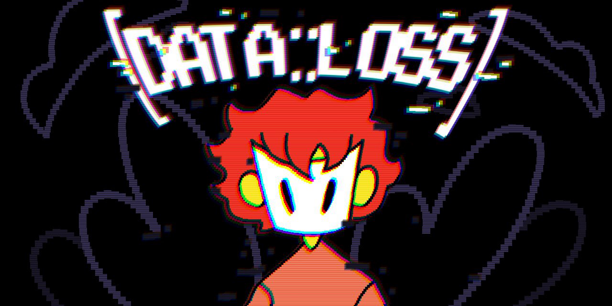

**[data::loss]** is a fast-paced side-scroller platforming game where you navigate a world full of graphical inconsistencies that have a habit of causing physical consequences.

This game was written purely in [Rust](https://www.rust-lang.org/), and interfaces with bindings to the [`raylib`](https://raylib.com) graphics library. For half the team, this has been their first experience with Rust. The other half have extensive experience in the language.

## Reviews

> Why would you make this game? Why would you do this to another person? Not everyone chose violence for this game jam. There was a game about a kobold making inventions out of junk to buy a nice rock. There was a physics game about mixing colored beads to make new colors. I saved some pirates from a dragon and some parrots in one game. This game took all my ideas of space and time and called them cringe. I don’t know what pit of hell you came from, but I hope you’re happy. 10/10. - [DragonSheep](https://ldjam.com/users/dragonsheep)

> ... Overall this is a great game, the art and music is awesome, and there’s a good dose of humor and sass to the game. Awesome job!! - [lukeoco1234](https://ldjam.com/users/lukeoco1234)

> Great game, really liked the aesthetic, it takes what would be an already cool reflex based autorun game and enhances is it with unique challenges in the levels. - [AidanV03](https://ldjam.com/users/aidanv03)

## The Team

This game was developed by a team of 9 students from *Sheridan College* and *Trent University*.

- [**Evan Pratten**](https://github.com/ewpratten)
  - Team lead
  - Software developer
  - Graphics library maintainer
  - Other LD games: [*Micromanaged Mike*](https://ldjam.com/events/ludum-dare/46/micromanaged-mike), [*Deep Breath*](https://github.com/ewpratten/ludum-dare-48)
- [**Carter Tomlenovich**](https://github.com/hyperliskdev)
  - Software developer
- [**Marcelo**](https://github.com/SNOWZ7Z)
  - Software developer
  - Level design
- [**Luna Sicardi**](https://github.com/LuS404)
  - Software developer
  - UI design
- [**Emilia Frias**](https://www.instagram.com/demilurii/)
  - Character art
  - Animations
- [**Kori**](https://www.instagram.com/korigama/)
  - Concept art
  - Tilesets
- **J.J.**
  - *"Composer? I hardly know her!"*
  - Playtesting
- [**James Feener**](https://twitter.com/jamesmakesgame)
  - Playtesting
- **Taya Armstrong**
  - Playtesting

A special thanks goes out to: [James Nickoli](https://github.com/rsninja722/) for insight on 2D collision detection, as well as [Ray](https://github.com/raysan5) and the members of the [raylib community](https://discord.gg/raylib) on discord for their support with the past two game jam projects.
